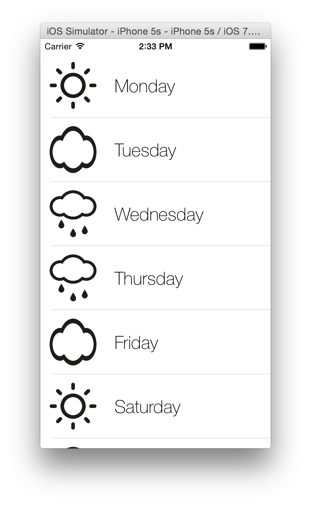
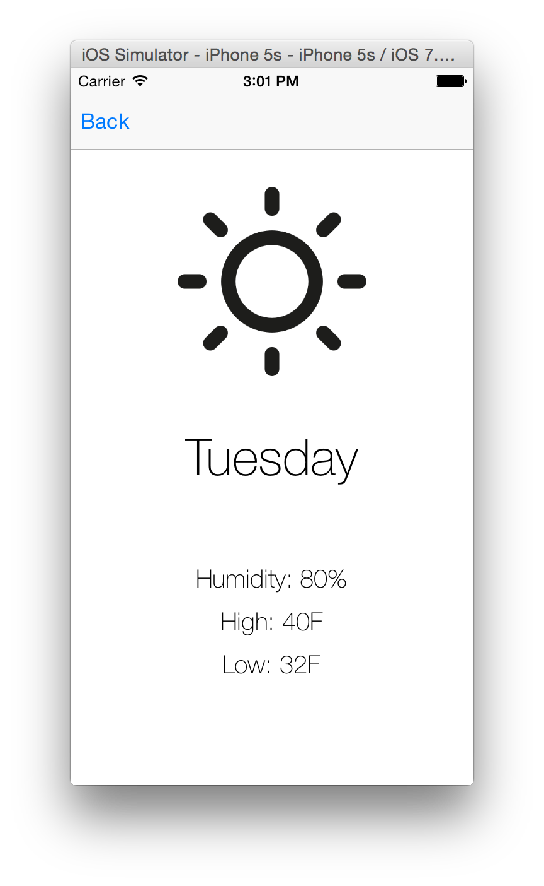

# iOS-Takehome

Thank you for interviewing with Nebari!

We have designed a project for you to work on at home so that you can show us your relevant iOS skills. We really appreciate you giving us your free time! Please do not spend more than 4 hours on this project.

To begin clone this repository and add your relevant files. When you are finished please issue a pull request against this project. Thanks!

## Project Requirements

Create an iOS application that pulls JSON data from the OpenWeather API and displays the next 7 day forecast in a UITableView (the `TableView screenshot` below). Tapping on a day from the UITableView brings the user to a detail page with additional information from the API — humidity, hi-temp and low-temp (the `Detail screenshot` below). The UI shown below is a suggestion — not a requirement — so feel free to make any improvements to the design of it.

## Project Details

###High Level
When creating the project please use the "Single View Application" template. It should compile and run in the iOS 7 simulator in Xcode. The weather icon does not need to match the actual forecast (the image can be chosen at random from the images included in the `/images` directory in this project or can be your own custom images).

### API Endpoint

The URL for JSON endpoint is from the site [OpenWeatherMap](http://openweathermap.org). At the time of writing this API is open to the public but an access key may be necessary for future requests. The API schema is available [here](http://openweathermap.org/api) but the request will likely look like:

`HTTP GET http://api.openweathermap.org/data/2.5/forecast/daily?q=Seattle&units=imperial&cnt=7`

(Feel free to use any city or any number of days in the forecast)

## Bonus Points

* Swift
* Auto Layout
* Custom animations
* Network requests with the new NSURLSession API

## Additional Help

Please let us know if anything is unclear or if you need help. We're here to provide guidance and if anything isn't clear about these instructions the blame falls on us, not you, so feel free to reach out.

Good luck and have fun!

## App Screenshots

